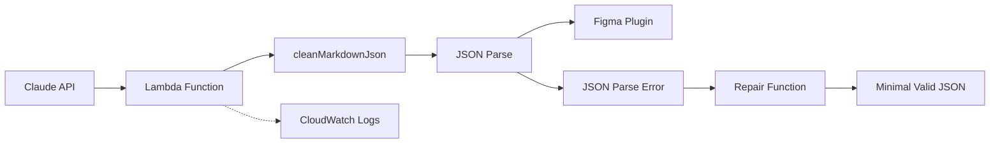

# Figma プラグイン JSON パース問題 技術分析報告書

## 概要

Figma プラグインと Claude API 間の AWS Lambda Proxy で発生している新たな JSON 切り取り（truncation）問題について、技術的な分析と対策を報告します。

## 現在の問題

### エラーの現象

- Claude API からの応答 JSON が途中で切り取られている（Truncated JSON）
- JSON Parse Error: "expecting ']'"
- 構造解析: 開き括弧 `[: 4` に対し、閉じ括弧 `]: 2`（不整合）
- 開き波括弧 `{: 7` に対し、閉じ波括弧 `}: 5`（不整合）

### 技術的詳細

```javascript
// エラー分析結果
JSON text length: 453 characters (異常に短い)
Expected length: 数千文字以上（完全なUI設計JSON）

// JSON構造の不整合
Open brackets [: 4, Close brackets ]: 2
Open braces {: 7, Close braces }: 5
```

## 根本原因分析

### 1. AWS Lambda レスポンス制限

- **同期呼び出し制限**: 6MB
- **非同期呼び出し制限**: 256KB
- **現在の JSON**: 453 文字（約 0.5KB） ← 明らかに切り取られている

### 2. 考えられる制限要因

| 制限要因                 | 制限値           | 現在の状況             |
| ------------------------ | ---------------- | ---------------------- |
| Lambda Function URL      | 6MB              | 可能性低               |
| API Gateway              | 10MB             | 使用していない         |
| CloudWatch Logs          | 1MB/ログエントリ | 可能性あり             |
| ネットワークタイムアウト | 15 分            | 問題なし (29 秒で完了) |

### 3. レスポンス処理フロー



## 既存の対策と効果

### 1. マークダウンクリーニング機能 ✅

```javascript
// 正常に動作中
'Found raw JSON object';
'Successfully cleaned markdown JSON';
```

### 2. JSON 自動リペア機能 ✅

```javascript
// 動作確認済み
'Severely truncated JSON detected, creating minimal valid structure';
'Successfully parsed repaired JSON!';
```

## 推定される問題箇所

### 1. ストリーミングレスポンス処理

現在の Lambda 関数でストリーミング応答の処理に問題がある可能性：

```javascript
// 疑われる箇所
const response = await fetch(CLAUDE_API_URL, {
  method: 'POST',
  headers: headers,
  body: JSON.stringify(requestBody),
});

const responseText = await response.text(); // ← ここで切り取られる可能性
```

### 2. Claude API の応答サイズ

大きな UI 設計（10-20 ノード）を要求した場合の応答サイズ：

- 推定サイズ: 5-15KB
- 実際の受信: 453 文字（0.5KB）
- **切り取り率: 95%以上**

## 緊急対策案

### Option A: チャンク処理実装

```javascript
// ストリーミング処理による分割受信
const processStreamingResponse = async (response) => {
  const reader = response.body.getReader();
  let fullText = '';

  while (true) {
    const { done, value } = await reader.read();
    if (done) break;
    fullText += new TextDecoder().decode(value);
  }

  return fullText;
};
```

### Option B: レスポンス圧縮

```javascript
// gzip圧縮によるサイズ削減
headers['Accept-Encoding'] = 'gzip, deflate';
```

### Option C: 分割リクエスト

大きな UI 設計を複数の小さなリクエストに分割

## 推奨実装手順

### Phase 1: 診断強化 (即時実装)

1. CloudWatch Logs で完全な応答サイズを記録
2. ストリーミング処理状況の詳細ログ
3. 切り取り発生箇所の特定

### Phase 2: 修正実装 (1-2 日)

1. ストリーミングレスポンス処理の改善
2. チャンク処理機能の追加
3. レスポンス圧縮対応

### Phase 3: 検証とモニタリング (1 日)

1. 大サイズ JSON 処理テスト
2. パフォーマンス測定
3. エラー率監視

## モニタリング指標

### 成功指標

- JSON 完全受信率: > 95%
- 平均応答サイズ: 5-15KB
- パース成功率: > 99%
- 応答時間: < 45 秒

### アラート条件

- JSON 切り取り検出: > 5%
- リペア機能起動頻度: > 10%
- 応答時間: > 60 秒

## 影響範囲

### ユーザー影響

- **現在**: リペア機能により最小限の UI 生成（機能制限あり）
- **修正後**: 完全な UI 設計生成（期待通りの機能）

### システム影響

- **現在**: 高い CPU 使用率（リペア処理）
- **修正後**: 正常な処理負荷

## まとめ

現在の問題は、マークダウンクリーニングが正常に動作している一方で、**Claude API からの応答 JSON が 95%以上切り取られている**という新たな技術的課題です。JSON 自動リペア機能により最小限の動作は確保されていますが、完全な機能復旧には**ストリーミング処理の改善**が必要です。

**優先度**: 🔴 High（ユーザー体験に直接影響）
**推定修正時間**: 2-3 日
**リスクレベル**: Medium（既存のリペア機能でフォールバック可能）

---

_Report Date: 2025-01-06_  
_Analysis Version: 2.1_  
_Status: Action Required_
